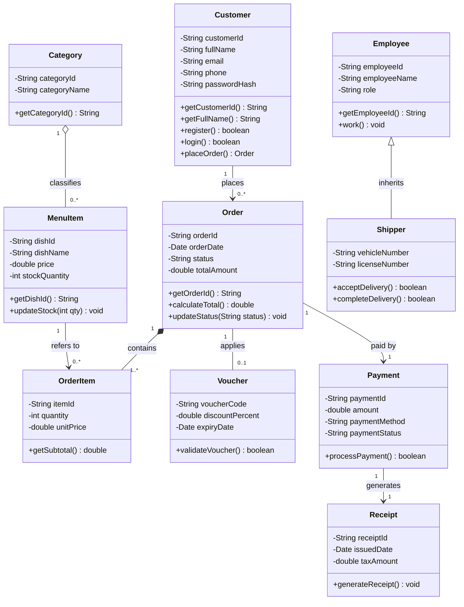

# [BTTH] Báo cáo Phân tích & Thiết kế Class Diagram Nền tảng Giao đồ ăn QuickBite

> 👤 **Học viên:** Đỗ Hoàng Sơn | **Mã SV:** PTIT-HCM-066
> 🏫 **Môn học:** IT105-K25-Phan-tich-thi-t-k-h-th-ng

---

## 📊 Sơ đồ thiết kế hệ thống (Class Diagram)

> 💡 *Sơ đồ dưới đây được render tự động trực tiếp trên GitHub bằng Mermaid. Bạn cũng có thể tải file **`bt1.drawio`** trong repository này để mở và chỉnh sửa trực tiếp trên [Draw.io (diagrams.net)](https://app.diagrams.net).* 

---

## Nhiệm vụ 1: Nhận diện Lớp và Khai báo Cấu trúc 3 ngăn

Sau khi đọc kỹ yêu cầu nghiệp vụ của hệ thống QuickBite, mình đã trích xuất ra 4 Lớp đối tượng quản lý cốt lõi gồm: Khách hàng (Customer), Đơn hàng (Order), Món ăn (MenuItem), và Nhân viên (Employee).

Mỗi lớp được thiết kế theo đúng chuẩn cấu trúc 3 ngăn UML bao gồm: Tên Lớp ở ngăn 1, các thuộc tính dữ liệu ở ngăn 2 và các phương thức xử lý nghiệp vụ ở ngăn 3.

- Lớp Customer: Quản lý thông tin định danh và tài khoản người dùng.
- Lớp Order: Quản lý vòng đời đơn hàng từ lúc tạo đến khi hoàn thành.
- Lớp MenuItem: Quản lý thông tin chi tiết món ăn trong thực đơn.
- Lớp Employee: Quản lý nhân sự chung của hệ thống.

## Nhiệm vụ 2: Thiết lập Bổ từ truy cập và Bảo vệ Dữ liệu

Để đảm bảo an toàn thông tin và tránh việc lộ dữ liệu nhạy cảm ra bên ngoài hệ thống, mình áp dụng nghiêm ngặt quy tắc đóng gói (Encapsulation).

Toàn bộ các thuộc tính quan trọng như mật khẩu, số dư, thông tin cá nhân của Lớp Customer và Lớp Employee đều được gán bổ từ truy cập Private (-). Đồng thời, các phương thức Getter và phương thức nghiệp vụ được mở Public (+) để giao tiếp an toàn.

- Sử dụng dấu trừ (-) cho các thuộc tính private như 'passwordHash', 'phone'.
- Sử dụng dấu cộng (+) cho các phương thức public như 'login()', 'placeOrder()'.

## Nhiệm vụ 3: Phân tích và Lựa chọn Mối quan hệ giữa các Lớp

Việc phân định đúng bản chất mối quan hệ giữa các đối tượng giúp code không bị lỗi logic và rác bộ nhớ:

Cặp Category - MenuItem sử dụng liên kết tập hợp Aggregation (<>), thể hiện danh mục chứa món ăn nhưng nếu xóa danh mục thì món ăn vẫn có thể được phân loại lại chứ không bị xóa sinh tử.

Cặp Order - OrderItem sử dụng liên kết cấu thành Composition (<*>), vì dòng chi tiết đơn hàng không thể tồn tại độc lập nếu thiếu Đơn hàng cha.

Cặp Employee - Shipper sử dụng liên kết tổng quát hóa Generalization (--|>), trong đó Shipper kế thừa toàn bộ thuộc tính và hành vi của Nhân viên.

- Aggregation (<>): Quan hệ tập hợp lỏng lẻo giữa Category và MenuItem.
- Composition (<*>): Quan hệ cấu thành sinh tử giữa Order và OrderItem.
- Generalization (--|>): Quan hệ kế thừa giữa Employee và Shipper.

## Nhiệm vụ 4: Xác định Bội số và Khóa chặt Ràng buộc Số lượng

Thiết lập chính xác con số Bội số (Multiplicity) ở hai đầu mối quan hệ giúp kiểm soát chặt chẽ ràng buộc dữ liệu đầu vào.

Giữa Customer và Order dùng bội số '1' và '0..*'. Giữa Order và OrderItem dùng bội số '1' và '1..*', việc bắt buộc tối thiểu 1 phần tử OrderItem giúp chặn triệt để lỗi tạo đơn hàng rỗng 0 món.

Giữa Order và Voucher dùng bội số '*' và '0..1' nhằm giới hạn mỗi đơn hàng chỉ được áp dụng tối đa 1 mã giảm giá.

- Bội số 1..* ở OrderItem giúp ngăn chặn lỗi tạo đơn hàng rỗng.
- Bội số 0..1 ở Voucher giới hạn mỗi đơn hàng chỉ dùng tối đa 1 mã giảm giá.

## Nhiệm vụ 5: Chuyển đổi kịch bản đặc tả Use Case sang Class Diagram

Dựa trên kịch bản Use Case 'Thanh toán Đơn hàng trực tuyến', mình thực hiện phương pháp phân tích Danh từ / Động từ để trích xuất các Lớp đối tượng phát sinh trong quá trình thanh toán.

| Thực thể trích xuất | Loại thực thể | Thuộc tính chính | Hành vi / Phương thức |
| --- | --- | --- | --- |
| Order | Thực thể chính | orderId, totalAmount | calculateTotal() |
| OrderItem | Thực thể thành phần | itemId, quantity, unitPrice | getSubtotal() |
| Payment | Thực thể nghiệp vụ | paymentId, amount, paymentMethod | processPayment() |
| Receipt | Thực thể kết quả | receiptId, issuedDate, taxAmount | generateReceipt() |

## Nhiệm vụ 6: Dựng Sơ đồ Class Diagram Tổng thể theo Quy trình 5 bước

Tổng hợp toàn bộ kết quả từ 5 nhiệm vụ trên, mình đã xây dựng bản vẽ Sơ đồ Class Diagram Tổng thể cho toàn bộ hệ thống QuickBite.

Bố cục sơ đồ được sắp xếp theo luồng trực quan từ trên xuống dưới (Top-Bottom), các đường nối được bẻ vuông góc 90 độ, tuyệt đối không để xảy ra tình trạng đan chéo đường nối gây rối mắt (không mạng nhện), đảm bảo lập trình viên Backend có thể nhìn vào và triển khai code ngay lập tức.

---

## 📁 Danh sách tệp tin nộp bài trong Repository
- 📝 `bt1.docx`: Báo cáo tài liệu phân tích nghiệp vụ hoàn chỉnh.
- 🎨 `bt1.drawio`: File thiết kế sơ đồ chuẩn theo quy định đề bài (mở trực tiếp bằng [Draw.io](https://app.diagrams.net) hoặc Lucidchart).
- 💻 `quickbite_models.java`: Mã nguồn chương trình.
